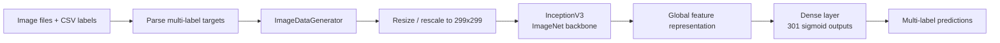

# Food Classification — Multi-Label Image Recognition

[](https://www.python.org/)
[](https://www.tensorflow.org/)
[](https://jupyter.org/)


[](LICENSE)

A computer-vision experiment for **multi-label food image classification** using transfer learning with **InceptionV3**. The notebook builds a 301-label classifier, prepares image generators from CSV annotations, and trains a sigmoid output head with binary cross-entropy.

> **Portfolio note:** this repository preserves the original experiment and documents it transparently. Dataset files and trained weights are not included, and no benchmark metric is claimed unless it is reproducible from the notebook.

## Why this project exists

Food imagery can contain more than one relevant class in a single image. That makes the problem different from standard single-label classification: the model must independently estimate the presence of many possible labels.

The project explores a practical transfer-learning workflow:

- read image metadata and multi-label annotations from CSV files;
- resize images to the InceptionV3 input resolution;
- reuse ImageNet features from a frozen convolutional backbone;
- learn a 301-unit sigmoid classification head;
- optimize with binary cross-entropy;
- use validation loss, checkpointing, and early stopping to control training.

## Modeling pipeline



## Technical details

| Component | Implementation |
|---|---|
| Problem type | Multi-label image classification |
| Input resolution | 299 × 299 |
| Label space | 301 labels |
| Backbone | InceptionV3 pretrained on ImageNet |
| Transfer-learning strategy | Backbone frozen in the original experiment |
| Output activation | Sigmoid |
| Loss | Binary cross-entropy |
| Optimizer | Adam |
| Training controls | Model checkpoint + early stopping |
| Main framework | TensorFlow / Keras |

A sigmoid output is appropriate here because labels are treated independently rather than as mutually exclusive classes.

## Repository structure

```text
.
├── Food classification.ipynb   # End-to-end data preparation, model and training workflow
├── .gitignore
├── .gitattributes
├── LICENSE                     # CC0 1.0
└── README.md
```

## Running the notebook

The notebook expects local data that is **not committed to this repository**, including CSV metadata and image files. In the original workflow the CSV files include training, validation, and submission/test metadata.

Typical dependencies include:

```text
tensorflow
keras-preprocessing
pandas
numpy
```

Open [`Food classification.ipynb`](Food%20classification.ipynb), update the dataset paths for your environment, and run the cells in sequence.

### Reproducibility note

This is an older research notebook. Current TensorFlow/Keras versions may require small API migrations—for example, generator and model-training APIs have evolved. For exact reproduction, use an environment compatible with the notebook or modernize the affected calls before retraining.

## Evaluation

The repository contains the training pipeline but does **not** currently preserve a clean, reproducible final benchmark table or trained model artifact. For that reason, this README intentionally does not advertise an accuracy/F1 score.

For a production-quality re-run, recommended metrics are:

- micro / macro F1;
- mean average precision (mAP);
- per-class precision and recall;
- threshold calibration for each label;
- error analysis on frequent and rare classes.

## Key engineering decisions

**Transfer learning.** InceptionV3 provides a strong pretrained visual representation and reduces the amount of task-specific training required.

**Independent label probabilities.** A sigmoid head and binary cross-entropy support samples containing multiple labels.

**Validation-based stopping.** Early stopping and checkpointing help avoid keeping a model solely because it trained for more epochs.

## Limitations

- The dataset is not included, so the notebook is not self-contained.
- Class IDs are numeric and the repository does not currently include a human-readable label dictionary.
- The original experiment freezes the backbone; fine-tuning later blocks may improve domain adaptation.
- The notebook does not package inference into a reusable Python module or API.
- No calibrated decision threshold or per-class evaluation report is stored in the repository.

## Good next steps

1. Add a dataset schema and label dictionary.
2. Refactor preprocessing, training, and inference into reusable modules.
3. Add deterministic seeds and an environment lock file.
4. Compare InceptionV3 with EfficientNet/ConvNeXt or a modern vision transformer.
5. Add class-imbalance handling and threshold optimization.
6. Export evaluation artifacts such as confusion/error analyses and mAP/F1 reports.

## Skills demonstrated

Computer vision · multi-label classification · transfer learning · TensorFlow/Keras · image pipelines · model training · experiment design

## License

This repository includes a [CC0 1.0 Universal](LICENSE) dedication. Dataset/model assets obtained from external sources may have their own terms and should be checked separately.
